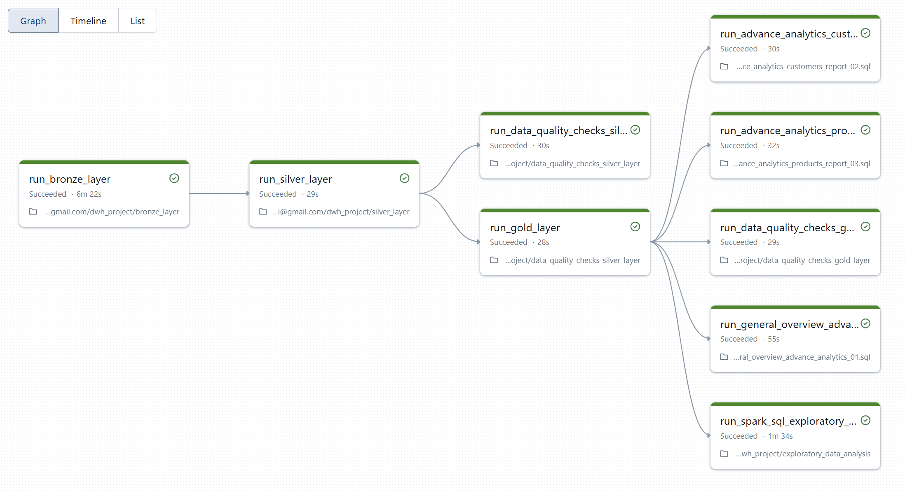
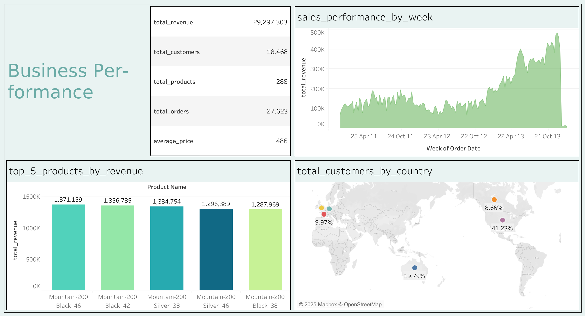

# Databricks SparkFlow Analytics 📊💸  

  
  
  
  
  

A **modern data lakehouse & analytics solution** built on **Databricks**, powered by **PySpark, Spark SQL, and Delta Lake** with **automated workflows** for scalable, reliable pipeline execution, seamlessly integrated with **Tableau** to deliver compelling and actionable **business visualizations**.

This project demonstrates **end-to-end data engineering and BI practices**:  

✅ Scalable **data lakehouse** design  
✅ Automated **ETL pipelines** with **Databricks Workflows**  
✅ **Star schema modeling** for analytics  
✅ **Actionable insights** through **Spark SQL** based reporting and **Tableau visualizations**

---

## 🖥 Data Architecture – Medallion Approach  

The project adopts the **Medallion Architecture** with three layers:  

| Layer   | Purpose |
|---------|---------|
| 🥉 **Bronze** | Raw ingested data from ERP/CRM CSV files with **incremental loading** for efficient processing. |
| 🥈 **Silver** | Cleaned & standardized data ensuring quality. |
| 🥇 **Gold**   | Business-ready, star schema data for BI & reporting  with **robust data validation**. |

## 🏗️ Medallion Architecture Diagram

---

## Pipeline Automation 🚀

This project includes **automated workflows** in **Databricks** to orchestrate the **Medallion Architecture ETL pipeline**, **data quality checks**, and **advanced analytics**. The workflow ensures seamless execution from raw data ingestion (Bronze) to business-ready insights (Gold), with error handling and logging.

### Workflow Details
**Bronze Layer**: **Incremental loading** efficiently processes large-scale ERP/CRM data, reducing costs and enabling near real-time updates. Ingests CSV data for tables like crm_cust_info, crm_prd_info, crm_sales_details, erp_loc_a101, erp_cust_az12, and erp_px_cat_g1v2 using **Delta Lake MERGE**. Key features:

- **Upsert** via unique keys (merge_key).
- **Deduplication** using load_timestamp or columns like cst_create_date.
- Error handling and load duration logging.

**Silver Layer**: Cleans, transforms, and quality-checks data for consistency.

**Gold Layer**: Builds star schema tables (dim_customers, dim_products, fact_sales) with robust validation via GoldenLayerDataValidation class, ensuring:

- No null values for data integrity.
- Deduplication on keys like cst_id, prd_id.

Analytics: Performs exploratory and advanced analytics.

This automation ensures scalability and reliability for **production-grade data pipelines**.

---

## 📖 Project Highlights  

- 🪙 **Data Architecture** – Medallion layers with **Delta Lake storage** for reliable data management.
- 🪙 **Incremental Loading** – Optimizes Bronze layer ingestion by processing only new or updated data, reducing compute overhead and enabling scalable **Automated ETL pipelines**.
- 🪙 **Robust Data Validation** – Utilizes GoldenLayerDataValidation class in the Gold layer to ensure clean, deduplicated data for accurate analytics and reporting.
- 🪙 **Automated ETL Pipelines** – Built in **PySpark & Spark SQL**.  
- 🪙 **Data Modeling** – Fact & dimension tables in a **star schema**.  

---

## 🗂 Repository Structure  

📂 **data_lakehouse**/

┣ 📂 **datasource**/ → Raw ERP & CRM CSV files

┣ 📂 **schema_documentation**/ → Data model & schema documentations

┣ 📂 **ETL_scripts**/ → ETL code (bronze_layer.py, incremental_bronze.py, silver_layer.py, gold_layer.py)

┣ 📂 **data_quality_checks**/ → Data quality & pipeline validation

📂 **data_analytics**/

┣ 📂 **analytics_scripts** / → exploratory_data_analysis (EDA) & advance_analytics

┣ 📂 **analytics_data_source** / → (gold.dim_customers.csv, gold.dim_products.csv, gold.fact_sales.csv)

┣ 📂 **data_analytics_roadmap** / → data_analytics_roadmap

📂 **data_visualisation/**  

┣ 📄 **business_performance.twbx** → Tableau packaged workbook for business performance dashboard  
┣ 🖼️ **business_performance.png** → Snapshot of the visualization  

---

## 🎯 Target Audience  

This project is designed for **data engineers, analysts, and students** showcasing expertise in:  

- 🐍 **PySpark & Spark SQL Development**  
- 🏗️ **Data Lakehouse with Medallion Architecture**  
- ⚙️ **Automated ETL Pipeline Engineering** 
- ⭐ **Star Schema Data Modeling** 
- 📊 **Data Analytics & BI** with **Tableau**

---

## 📊 Business Insights  

Analytics & reporting focus on:  

- 👥 **Customer Behavior** – Segmentation (VIP, Regular, New), retention, churn.  
- 📦 **Product Performance** – Category contribution, sales vs. costs.  
- 📅 **Sales Trends** – Seasonal patterns, regional metrics, growth tracking.  

These insights are visualized through **Tableau** dashboards, supporting **strategic business decisions**.  

  ### Business Performance Dashboard Example: 

---

## 🛠 Technologies Used  

- 🔧 **Databricks** – Unified data platform  
- 🐍 **PySpark** – Scalable automated ETL pipelines  
- 📜 **Spark SQL** – Transformations & analytics  
- 💾 **Delta Lake** – Reliable, versioned storage
- 📊 **Tableau** – Visualization for business insights

---

## 🛡️ License  

Licensed under the **MIT License**.  

---

✨ With SparkFlow Analytics, raw ERP & CRM data is transformed into a **scalable, analytics-ready lakehouse** that powers **data-driven business insights** through **PySpark**, **Spark SQL**, **Delta Lake**, and **Tableau visualizations**.

