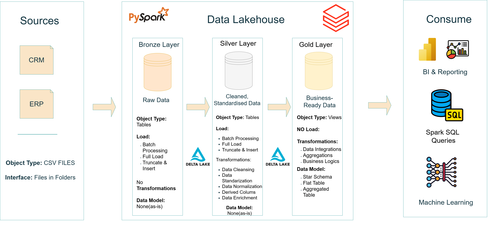

# Databricks SparkFlow Analytics 📊💸  

  
  
  
  

A **modern data lakehouse & analytics solution** built on **Databricks**, powered by **PySpark, Spark SQL, and Delta Lake**.  

This project demonstrates end-to-end **data engineering and BI practices**:  

✅ Scalable **data lakehouse** design  
✅ Automated **ETL pipelines**  
✅ **Star schema modeling** for analytics  
✅ **Actionable insights** through Spark SQL-based reporting  

---

## 🖥 Data Architecture – Medallion Approach  

The project adopts the **Medallion Architecture** with three layers:  

| Layer   | Purpose |
|---------|---------|
| 🥉 **Bronze** | Raw ingested data from ERP/CRM CSV files. |
| 🥈 **Silver** | Cleaned & standardized data ensuring quality. |
| 🥇 **Gold**   | Business-ready, star schema data for BI & reporting. |

## 🏗️ Medallion Architecture Diagram

---

## 📖 Project Highlights  

- 🪙 **Data Architecture** – Medallion layers with Delta Lake storage.  
- 🪙 **ETL Pipelines** – Built in PySpark & Spark SQL.  
- 🪙 **Data Modeling** – Fact & dimension tables in a **star schema**.  
- 🪙 **Analytics & BI** – SQL queries that generate insights for business stakeholders.  

---

## 🗂 Repository Structure  

📂 **data_lakehouse**/

┣ 📂 **datasource**/ → Raw ERP & CRM CSV files

┣ 📂 **schema_documentation**/ → Data model & schema documentations

┣ 📂 **ETL_scripts**/ → ETL code (bronze_layer.py, silver_layer.py, gold_layer.py)

┣ 📂 **data_quality_checks**/ → Data quality & pipeline validation

📂 **data_analytics**/

┣ 📂 **analytics_scripts** / → exploratory_data_analysis (EDA) & advance_analytics

┣ 📂 **analytics_data_source** / → (gold.dim_customers.csv, gold.dim_products.csv, gold.fact_sales.csv)

┣ 📂 **data_analytics_roadmap** / → data_analytics_roadmap

---

## 🎯 Target Audience  

This project is designed for **data engineers, analysts, and students** showcasing expertise in:  

- 🐍 **PySpark & Spark SQL Development**  
- 🏗️ **Data Warehousing with Medallion Architecture**  
- ⚙️ **ETL Pipeline Engineering** 
- ⭐ **Star Schema Data Modeling** 
- 📊 **Data Analytics & BI**  

---

## 📊 Business Insights  

Analytics & reporting focus on:  

- 👥 **Customer Behavior** – Segmentation (VIP, Regular, New), retention, churn.  
- 📦 **Product Performance** – Category contribution, sales vs. costs.  
- 📅 **Sales Trends** – Seasonal patterns, regional metrics, growth tracking.  

These insights support **strategic business decisions**.  

---

## 🛠 Technologies Used  

- 🔧 **Databricks** – Unified data platform  
- 🐍 **PySpark** – Scalable ETL pipelines  
- 📜 **Spark SQL** – Transformations & analytics  
- 💾 **Delta Lake** – Reliable, versioned storage  

---

## 🛡️ License  

Licensed under the **MIT License**.  

---

✨ With SparkFlow Analytics, raw ERP & CRM data is transformed into a **scalable, analytics-ready warehouse** that powers **data-driven business insights**.  

