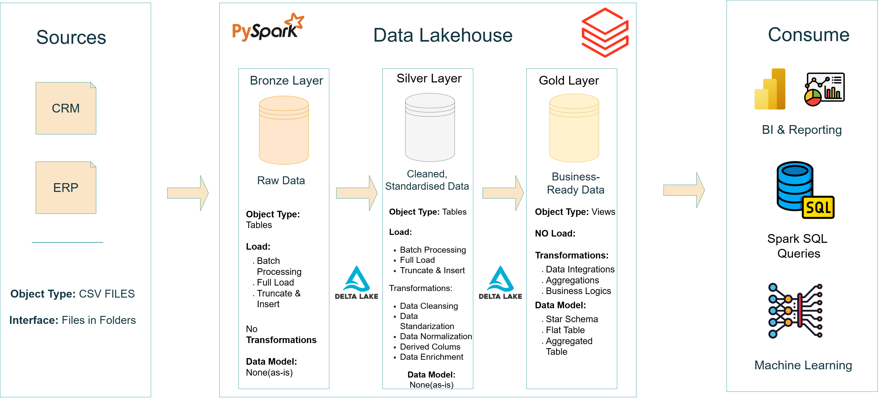
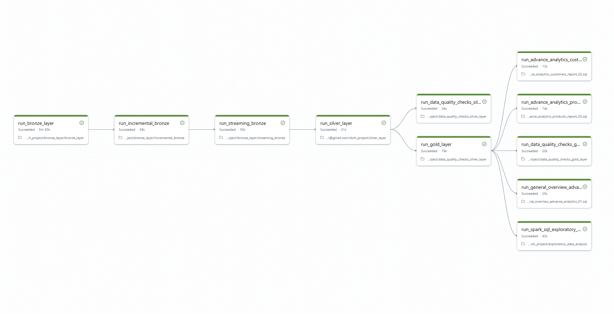
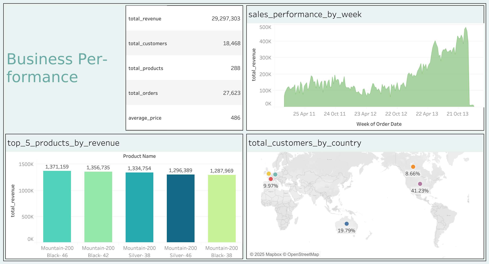

# Databricks SparkFlow Analytics 📊💸  

  
  
  
  
  

A **modern data lakehouse & analytics solution** built on **Databricks**, powered by **PySpark, Spark SQL, and Delta Lake**. This project features **automated ETL pipelines**, **batch and real-time streaming ingestion**, a **Medallion Architecture**, and a **star schema** for analytics, seamlessly integrated with **Tableau** for compelling and actionable **business visualizations**.

✅ Scalable **data lakehouse** design  
✅ Automated **ETL pipelines** with **streaming and batch processing** using **Databricks Workflows**  
✅ **Star schema modeling** for analytics  
✅ **Actionable insights** through **Spark SQL** based reporting and **Tableau visualizations**

---

## 🖥 Data Architecture – Medallion Approach  

The project adopts the **Medallion Architecture** with three layers:  

| Layer   | Purpose |
|---------|---------|
| 🥉 **Bronze** | Raw ingested data from ERP/CRM CSV files, supporting both **batch and streaming ingestion** for efficient, near **real-time updates** |
| 🥈 **Silver** | Cleaned & standardized data ensuring quality. |
| 🥇 **Gold**   | Business-ready, star schema data for BI & reporting  with **robust data validation**. |

## 🏗️ Medallion Architecture Diagram

---

## Pipeline Automation 🚀

This project includes **automated workflows** in **Databricks** to orchestrate the **Medallion Architecture ETL pipeline**, **data quality checks**, and **advanced analytics**. It supports both **batch** and **streaming data ingestion**, ensuring scalability, reliability, and production-grade execution from raw data (Bronze) to **business-ready** insights (Gold).

---

### 🛠️ Workflow Details
- **🥉Bronze Layer**: Ingests raw ERP/CRM data using **Delta Lake MERGE** operations.
  - **Batch Ingestion**: Handles large-scale data efficiently with incremental loading (`incremental_bronze.py`).  
  - Key features:  
    - Upserts via unique keys (e.g., `cst_id`, `prd_key`).  
    - Deduplication using `load_timestamp` or domain-specific columns (e.g., `cst_create_date`).  
    - Logging and error handling for robust pipeline execution.  
  - **Streaming Ingestion**: Processes CSV files in real time from directories using PySpark Structured Streaming (`streaming_bronze.py`), with deduplication, error handling, and checkpointing for fault tolerance.  
  
- **🥈 Silver Layer**: Cleans, transforms, and applies quality checks to ensure data consistency and integrity.  

- **🥇 Gold Layer**: Builds star schema tables (`dim_customers`, `dim_products`, `fact_sales`) with **robust data validation** using the `GoldenLayerDataValidation` class, ensuring:  
  - No null values in critical fields.  
  - Deduplication on keys like `cst_id`, `prd_id`.  

- **📊 Analytics**: Performs **exploratory data analysis (EDA)** and **advanced analytics** for actionable insights.  

This automation ensures **scalable, reliable, and near real-time data pipelines**, optimized for production environments.

---

## 📖 Project Highlights
- 🪙 **Data Architecture** – Medallion layers with **Delta Lake storage** for reliable data management.
- 🪙 **Batch & Streaming Ingestion**: Combines **incremental batch processing** (`incremental_bronze.py`) and **real-time streaming** (`streaming_bronze.py`) for flexible, cost-efficient data ingestion.
- 🪙 **Robust Data Validation** – Utilizes **GoldenLayerDataValidation class** in the Gold layer to ensure clean, deduplicated data for accurate analytics and reporting.
- 🪙 **Automated ETL Pipelines** – Built in **PySpark & Spark SQL**.
- 🪙 **Data Modeling** – Fact & dimension tables in a **star schema**.  

---

## 🗂 Repository Structure  

📂 **data_lakehouse**/

┣ 📂 **datasource**/ → Raw ERP & CRM CSV files

┣ 📂 **schema_documentation**/ → Data model & schema documentations

┣ 📂 **ETL_scripts**/ → ETL code (`bronze_layer.py`, `incremental_bronze.py`, `streaming_bronze.py`, `silver_layer.py`, `gold_layer.py`)

┣ 📂 **data_quality_checks**/ → Data quality & pipeline validation

📂 **data_analytics**/

┣ 📂 **analytics_scripts** / → exploratory_data_analysis (EDA) & advance_analytics

┣ 📂 **analytics_data_source** / → (`gold.dim_customers.csv`, `gold.dim_products.csv`, `gold.fact_sales.csv`)  

┣ 📂 **data_analytics_roadmap** / → data_analytics_roadmap

📂 **data_visualisation/**  

┣ 📄 **business_performance.twbx** → Tableau packaged workbook for business performance dashboard  
┣ 🖼️ **business_performance.png** → Snapshot of the visualization  

---

## 🎯 Target Audience  

This project is designed for **data engineers, analysts, and students** showcasing expertise in:
- 🐍 **PySpark & Spark SQL Development**
- 🏗️ **Data Lakehouse with Medallion Architecture**
- ⚙️ **Automated ETL Pipeline Engineering (Streaming & Batch)**
- ⭐ **Star Schema Data Modeling**
- 📊 **Data Analytics & BI** with **Tableau**

---

## 📊 Business Insights  

Analytics & reporting focus on:  

- 👥 **Customer Behavior** – Segmentation (VIP, Regular, New), retention, churn.  
- 📦 **Product Performance** – Category contribution, sales vs. costs.  
- 📅 **Sales Trends** – Seasonal patterns, regional metrics, growth tracking.  

These insights are visualized through **Tableau** dashboards, supporting **strategic business decisions**.  

  ### Business Performance Dashboard Example: 

---

## 🛠 Technologies Used  

- 🔧 **Databricks** – Unified data platform  
- 🐍 **PySpark** – Scalable automated ETL pipelines  
- 📜 **Spark SQL** – Transformations & analytics  
- 💾 **Delta Lake** – Reliable, versioned storage
- 📊 **Tableau** – Visualization for business insights

---

## 🛡️ License  

Licensed under the **MIT License**.  

---

✨ With SparkFlow Analytics, raw ERP & CRM data is transformed into a **scalable, analytics-ready lakehouse** that powers **data-driven business insights** through **PySpark**, **Spark SQL**, **Delta Lake**, and **Tableau visualizations**.

